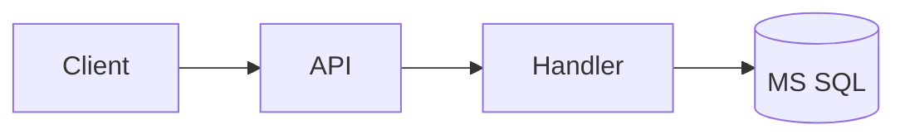
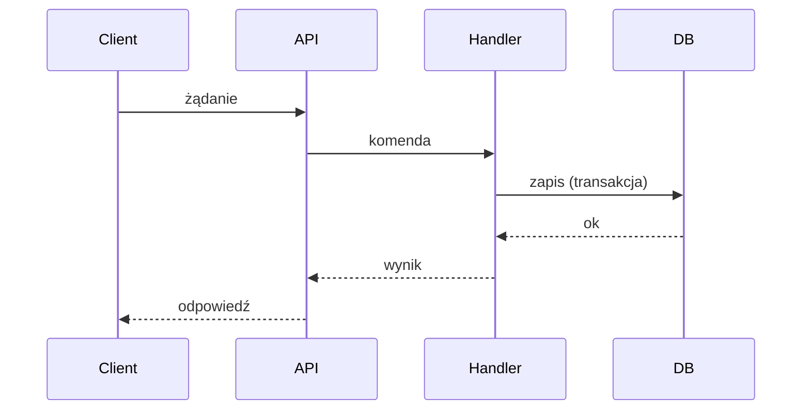

# Feature Spec — szablon specyfikacji technicznej

Ten skill definiuje **kanoniczny szablon `spec.md`** dla zmiany w backendzie .NET 10.
Specyfikacja ma **dokładnie 15 sekcji** w podanej kolejności i numeracji. Nie dodawaj,
nie usuwaj i nie zmieniaj kolejności sekcji — uzupełniaj ich treść.

Stosuj reguły ze skilla `backend-doc-conventions` (język polski, „nie zgaduj — dopytaj”,
notacja `> [ZAŁOŻENIE]` / `> [DO USTALENIA]`, zapis tylko do `docs/features/<slug>/`).

## Reguły wypełniania

- Wypełniaj tylko to, co wynika z opisu feature, kodu repo i wcześniejszych decyzji.
- Każdą lukę istotną dla projektu oznacz `> [DO USTALENIA] ...` w danej sekcji **oraz** dopisz
  do sekcji **14**.
- Świadome uproszczenia: `> [ZAŁOŻENIE] ...`.
- Diagramy w blokach ```mermaid``` (flowchart w sek. 5, sequence w sek. 8).
- `status` w metadanych: `draft` (autor) → `refining` (w trakcie doprecyzowania) →
  `ready` (brak jakiegokolwiek `[DO USTALENIA]`).

## Szkielet do skopiowania

```markdown
# Specyfikacja: <Nazwa feature>

## 1. Metadane
- **Nazwa**: <pełna nazwa feature>
- **Slug**: <kebab-case>
- **Status**: draft | refining | ready
- **Autor**: <autor / agent>
- **Data utworzenia**: <YYYY-MM-DD>
- **Data aktualizacji**: <YYYY-MM-DD>
- **Powiązane usługi/systemy**: <lista mikroserwisów, baz, kolejek, systemów zewnętrznych>

## 2. Kontekst i cel
- **Problem**: <co dziś nie działa / czego brakuje>
- **Motywacja biznesowa**: <po co to robimy, jaka wartość>
- **Cel**: <mierzalny rezultat zmiany>
- **Zakres**: <co wchodzi w zakres>
- **Poza zakresem**: <co świadomie pomijamy>

## 3. Wymagania funkcjonalne
- **Przypadki użycia / historyjki**:
  - UC-1: Jako <rola> chcę <cel>, aby <korzyść>.
- **Reguły biznesowe**:
  - BR-1: <reguła>
- **Kryteria akceptacji (wysokopoziomowe)**:
  - <warunek spełnienia>

## 4. Wymagania niefunkcjonalne
- **Wydajność**: <p95/p99 latencji, przepustowość>
- **Skalowalność**: <wzorce obciążenia, horyzontalność>
- **Dostępność / SLA**: <cel dostępności, okna serwisowe>
- **Bezpieczeństwo (wysokopoziomowo)**: <klasa danych, wymogi>
- **Obserwowalność (wymogi)**: <co musi być mierzalne>
- **Limity i kwoty**: <rate limits, rozmiary, timeouty>

## 5. Architektura rozwiązania
- **Komponenty i odpowiedzialności**:
  - <komponent>: <za co odpowiada>
- **Miejsce zmiany w istniejącym systemie**: <która warstwa/moduł/serwis>
- **Diagram przepływu**:



## 6. Kontrakty API
- **Styl**: REST | gRPC | komendy/eventy (dispatcher)
- **Endpointy / handlery**:
  - `POST /api/...` — <opis>
- **Request**:

```json
{ }
```

- **Response**:

```json
{ }
```

- **Kody błędów**: <mapowanie błąd → kod HTTP/gRPC + payload>
- **Walidacja**: <reguły, FluentValidation?>
- **Wersjonowanie**: <strategia, kompatybilność>

## 7. Model danych
- **Tabele MS SQL**:

```sql
-- Tabela: <nazwa>
-- kolumny, typy, NULL/NOT NULL, klucze, indeksy
```

- **Migracje**: <opis migracji EF Core, kolejność, dane startowe>
- **Redis** (jeśli dotyczy): <klucze, TTL, struktury, wzorzec użycia>
- **Kafka** (jeśli dotyczy): <topiki, klucz partycji, schemat payloadu, retencja>

## 8. Przepływy i sekwencje
- **Diagram sekwencji**:



- **Przypadki brzegowe**: <lista>
- **Idempotencja**: <klucz idempotentności, zachowanie przy retry/duplikacie>
- **Transakcyjność**: <granice transakcji, outbox, saga>
- **Kolejność zdarzeń i spójność**: <ordering, eventual vs strong consistency>

## 9. Integracje i zależności zewnętrzne
- **Inne usługi**: <nazwa, rola, kontrakt, tryb (sync/async)>
- **Kolejki / cache**: <zależności i ich kontrakty>
- **Kontrakty zdarzeń**: <produkowane/konsumowane eventy, wersje schematów>
- **Tryb awarii zależności**: <fallback, retry, circuit breaker>

## 10. Bezpieczeństwo
- **Uwierzytelnianie**: <mechanizm, np. JWT/IdentityServer>
- **Autoryzacja**: <role, scopes, polityki>
- **Dane wrażliwe**: <klasyfikacja, szyfrowanie, maskowanie>
- **Sekrety**: <gdzie i jak przechowywane>
- **Audyt**: <co i jak logujemy do celów audytowych>

## 11. Obserwowalność
- **Logi**: <poziomy, format, korelacja (trace/correlation id)>
- **Metryki**: <liczniki, histogramy, SLI>
- **Trace**: <spany, propagacja kontekstu>
- **Alerty**: <warunki, progi, odbiorcy>

## 12. Wdrożenie i rollback
- **Feature flags**: <nazwa flagi, strategia rolloutu>
- **Kompatybilność wsteczna**: <kontrakty API/DB, migracje rozłączne>
- **Migracja danych**: <plan, backfill, idempotentność>
- **Plan wycofania (rollback)**: <kroki, punkt bez powrotu>

## 13. Testowanie
- **Strategia i poziomy**: unit / integracyjne / e2e — co na którym poziomie
- **Kluczowe scenariusze**: <happy path>
- **Scenariusze brzegowe i błędne**: <lista>
- **Dane testowe / środowiska**: <wymogi>

## 14. Ryzyka i otwarte pytania
| # | Kwestia | Typ | Status | Wpływ |
|---|---------|-----|--------|-------|
| 1 | <opis> | [DO USTALENIA] / ryzyko | otwarte / rozwiązane | <opis> |

> [DO USTALENIA] <pełna lista otwartych pytań blokujących status `ready`>

## 15. Decyzje projektowe (ADR)
Wypełniane głównie w fazie doprecyzowania. Każdy wpis: kontekst → decyzja → konsekwencje.
Pełny log w `decisions.md`; tu skrót najważniejszych.

- **D-1: <tytuł decyzji>**
  - Kontekst: <co wymagało decyzji>
  - Decyzja: <co postanowiono>
  - Konsekwencje: <skutki, kompromisy>
  - Link: `decisions.md#d-1`
```

## Szablon wpisu w `decisions.md`

```markdown
## D-<n>: <tytuł>
- **Data**: <YYYY-MM-DD>
- **Status**: zaproponowana | przyjęta | odrzucona | zastąpiona przez D-<m>
- **Kontekst**: <problem decyzyjny i ograniczenia>
- **Decyzja**: <wybrana opcja>
- **Rozważane alternatywy**: <opcje i dlaczego odrzucone>
- **Konsekwencje**: <pozytywne i negatywne skutki>
```
