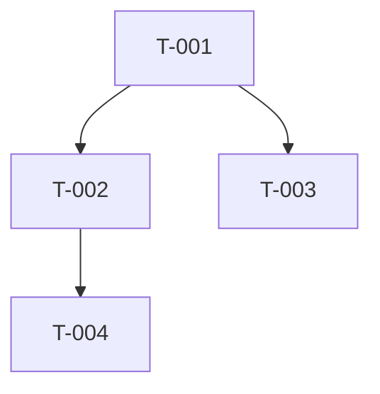

# Feature Tasks — szablon `tasks.md`

Ten skill definiuje format **dekompozycji na drobne zadania** wyprowadzone z `plan.md`
(`spec.md` jako referencja). Cel: lista tasków na tyle drobnych, że pojedynczy task to jeden
spójny, weryfikowalny krok. Ten agent sam nie implementuje kodu — `tasks.md` jest ostatnim
artefaktem fazy dokumentacyjnej i **wejściem do fazy 5+** (implementacja w cyklu TDD).

Stosuj reguły ze skilla `backend-doc-conventions` (polski, „nie zgaduj — dopytaj”, notacja,
zapis tylko do `docs/features/<slug>/`).

## Reguły dekompozycji

- **Drobnoziarnistość**: jeden task = jeden spójny, sprawdzalny krok (zwykle rozmiar S/M).
- **Grupowanie po wartości (domyślne)**: grupuj taski w **plasterki wertykalne per przypadek
  użycia** (UC-* ze spec §3), tak by **każda grupa była niezależnie implementowalna i
  testowalna** end-to-end. Pierwsza grupa to **MVP** — najmniejszy działający przepływ.
  Cel: dostarczać demonstrowalną wartość wcześnie, zamiast budować wszystkie warstwy „w poziomie"
  i czekać na działający przepływ do końca.
- **Topologia wewnątrz plasterka**: w obrębie grupy zachowaj realną kolejność warstw (kontrakty i
  model danych przed logiką, która z nich korzysta). Sortowanie topologiczne obowiązuje **w
  ramach** plasterka i między plasterkami zależnymi.
- **Znacznik równoległości `[P]`**: oznacz `[P]` taski, które można robić równolegle (nie dzielą
  plików ani nie zależą od siebie). Brak `[P]` = task sekwencyjny względem poprzedników.
- **Oznaczenie MVP**: pierwszą grupę/plasterek oznacz `(MVP)` w nazwie.
- Jeśli `plan.md` narzuca podział czysto warstwowy i feature nie ma sensownych plasterków UC —
  dopuszczalne jest grupowanie po warstwach; odnotuj to jako `[ZAŁOŻENIE]`.
- **Identyfikatory**: `T-001`, `T-002`, … (stałe, nie renumeruj przy edycjach idempotentnych).
- **Zależności**: lista ID tasków, które muszą być gotowe wcześniej (lub `—` gdy brak).
- **Kryteria akceptacji**: checklista `- [ ]`, konkretne i sprawdzalne (nie „działa poprawnie”).
- **Status (obowiązkowy)**: **każdy** task ma linię `- **Status**:` — domyślnie `do zrobienia`,
  a dla taska zablokowanego `BLOCKED (przez: <[DO USTALENIA] #X>)`. To pole jest kontraktem dla
  fazy implementacyjnej (faza 5+ wybiera i aktualizuje taski po statusie) — nie pomijaj go.
- **Blokady**: taski zależne od nierozstrzygniętych `[DO USTALENIA]` ze spec oznacz jawnie
  flagą `BLOCKED` (w polu `Status`) i wskaż, która otwarta kwestia je blokuje. Nie ukrywaj blokad.

## Szkielet do skopiowania

````markdown
# Zadania: <Nazwa feature>

- **Slug**: <kebab-case>
- **Na podstawie**: plan.md (data: <YYYY-MM-DD>), spec.md
- **Data**: <YYYY-MM-DD>

## Legenda
- Rozmiar: **S** (≤0.5 dnia) / **M** (≤2 dni) / **L** (>2 dni — rozważ podział).
- `[P]` — task równoległy (nie dzieli plików / nie zależy od rodzeństwa w grupie).
- `(MVP)` — grupa realizująca najmniejszy działający przepływ end-to-end.
- `BLOCKED` — zablokowany przez otwartą kwestię ze spec.

## Grupa A: <przypadek użycia / plasterek> (MVP)

### T-001 — <tytuł>
- **Opis**: <krótko, co należy zrobić>
- **Kryteria akceptacji**:
  - [ ] <warunek 1, sprawdzalny>
  - [ ] <warunek 2>
- **Zależności**: — | T-000, ...
- **Obszar kodu / pliki** (wskazówka): <np. src/Api/..., src/Application/Handlers/...>
- **Powiązanie**: spec §<n> (UC-<n>) / plan §<n>.<poz>
- **Rozmiar**: S | M | L
- **Równoległość**: `[P]` | —
- **Status**: do zrobienia | BLOCKED (przez: <[DO USTALENIA] #X>)

### T-002 — <tytuł>
- **Opis**: ...
- **Kryteria akceptacji**:
  - [ ] ...
- **Zależności**: T-001
- **Obszar kodu / pliki**: ...
- **Powiązanie**: spec §... (UC-...) / plan §...
- **Rozmiar**: ...
- **Równoległość**: `[P]` | —
- **Status**: do zrobienia | BLOCKED (przez: ...)

## Grupa B: <kolejny przypadek użycia / plasterek>
...

## Podsumowanie zależności (opcjonalnie)



## Zadania zablokowane
- **T-0XX** — blokowane przez `[DO USTALENIA] #X` (sekcja 14 spec): <opis kwestii>.
````
