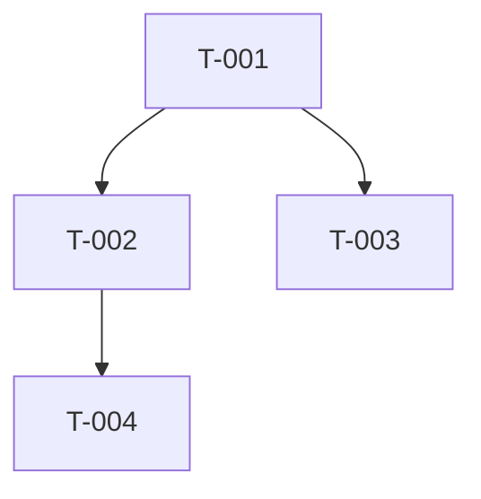

# Feature Tasks — szablon `tasks.md`

Ten skill definiuje format **dekompozycji na drobne zadania** wyprowadzone z `plan.md`
(`spec.md` jako referencja). Cel: lista tasków na tyle drobnych, że pojedynczy task to jeden
spójny, weryfikowalny krok. Implementacja kodu jest poza zakresem — to ostatni artefakt workflow.

Stosuj reguły ze skilla `backend-doc-conventions` (polski, „nie zgaduj — dopytaj”, notacja,
zapis tylko do `docs/features/<slug>/`).

## Reguły dekompozycji

- **Drobnoziarnistość**: jeden task = jeden spójny, sprawdzalny krok (zwykle rozmiar S/M).
- **Sortowanie topologiczne**: taski uporządkowane tak, że zależności poprzedzają zależne.
- **Grupowanie logiczne**: po warstwach/kamieniach milowych z `plan.md` (np. „Kontrakty i model
  danych”, „Handlery”, „Obserwowalność”).
- **Identyfikatory**: `T-001`, `T-002`, … (stałe, nie renumeruj przy edycjach idempotentnych).
- **Zależności**: lista ID tasków, które muszą być gotowe wcześniej (lub `—` gdy brak).
- **Kryteria akceptacji**: checklista `- [ ]`, konkretne i sprawdzalne (nie „działa poprawnie”).
- **Blokady**: taski zależne od nierozstrzygniętych `[DO USTALENIA]` ze spec oznacz jawnie
  flagą `BLOCKED` i wskaż, która otwarta kwestia je blokuje. Nie ukrywaj blokad.

## Szkielet do skopiowania

```markdown
# Zadania: <Nazwa feature>

- **Slug**: <kebab-case>
- **Na podstawie**: plan.md (data: <YYYY-MM-DD>), spec.md
- **Data**: <YYYY-MM-DD>

## Legenda
- Rozmiar: **S** (≤0.5 dnia) / **M** (≤2 dni) / **L** (>2 dni — rozważ podział).
- `BLOCKED` — zablokowany przez otwartą kwestię ze spec.

## Grupa A: <nazwa grupy / kamień milowy>

### T-001 — <tytuł>
- **Opis**: <krótko, co należy zrobić>
- **Kryteria akceptacji**:
  - [ ] <warunek 1, sprawdzalny>
  - [ ] <warunek 2>
- **Zależności**: — | T-000, ...
- **Obszar kodu / pliki** (wskazówka): <np. src/Api/..., src/Application/Handlers/...>
- **Powiązanie**: spec §<n> / plan §<n>.<poz>
- **Rozmiar**: S | M | L
- **Status**: do zrobienia | BLOCKED (przez: <[DO USTALENIA] #X>)

### T-002 — <tytuł>
- **Opis**: ...
- **Kryteria akceptacji**:
  - [ ] ...
- **Zależności**: T-001
- **Obszar kodu / pliki**: ...
- **Powiązanie**: spec §... / plan §...
- **Rozmiar**: ...

## Grupa B: <nazwa>
...

## Podsumowanie zależności (opcjonalnie)



## Zadania zablokowane
- **T-0XX** — blokowane przez `[DO USTALENIA] #X` (sekcja 14 spec): <opis kwestii>.
```
