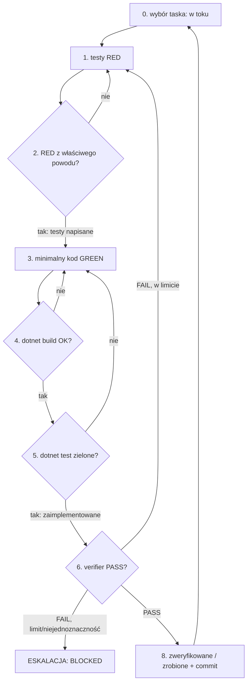

# Task Implementation Loop (maszyna stanów iteracji jednego taska)

Ten skill definiuje **jawną maszynę stanów** realizacji **jednego** taska z `tasks.md`
w cyklu TDD. Orchestrator ładuje go po `backend-impl-conventions` i prowadzi pętlę,
delegując poszczególne kroki do subagentów. Ten skill opisuje *przebieg* — bramki
techniczne definiuje `backend-testing`, reguły dyscypliny `backend-impl-conventions`.

## Kroki maszyny stanów

**(0) Wybór taska** — *orchestrator.*
Wybierz następny **wykonalny** task: wszystkie jego **zależności** są w statusie
`zweryfikowane / zrobione`, a task **nie** jest `BLOCKED` i nie jest już `zrobione`.
Brak takiego taska → koniec przebiegu (patrz „Warunki wyjścia"). Ustaw status `w toku`.

**(1) Napisz failujące testy (RED)** — *delegacja do `feature-test-author`.*
Z kryteriów akceptacji taska + powiązanych sekcji `spec.md` powstają testy; każde
kryterium → co najmniej jeden test (mapowanie wg `backend-testing` §5).

**(2) Uruchom testy — potwierdź RED** — *autor testów / orchestrator.*
`dotnet test` musi pokazać **czerwień z właściwego powodu** (brak implementacji), nie
z przypadkowego błędu kompilacji w niepowiązanym miejscu. Po potwierdzeniu orchestrator
ustawia status `testy napisane`.

**(3) Implementuj minimalny kod (GREEN)** — *delegacja do `feature-implementer`.*
Najmniejsza zmiana w `src/` spełniająca testy i kryteria taska, zgodnie z warstwami i
wzorcami repo. Bez wychodzenia poza zakres taska.

**(4) `dotnet build` — musi się kompilować** — *bramka.*
Błąd kompilacji → wróć do (3) z diagnostyką (komunikaty kompilatora).

**(5) `dotnet test` — wszystko zielone** — *bramka.*
Testy taska i cały zestaw na zielono. Fail → diagnozuj: jeśli problem w kodzie → (3);
jeśli test był błędny/niekompletny → (1). Po zielonym orchestrator ustawia status
`zaimplementowane`.

**(6) Weryfikacja kryteriów + zgodności ze spec + konstytucji** — *delegacja do `feature-verifier`.*
Verifier uruchamia build/test niezależnie i sprawdza checklistę kryteriów akceptacji,
zgodność ze `spec.md` (kontrakty API, model danych, reguły, bezpieczeństwo) **oraz zgodność z
`docs/constitution.md`** (zasady `P-*`, jeśli istnieje). Dla tasków wrażliwych (auth/dane/
sekrety) obowiązuje **bramka bezpieczeństwa** (`backend-impl-conventions §6`, opcjonalnie skill
`security-review`). Zwraca werdykt **PASS/FAIL** + listę niespełnionych pozycji + diagnostykę.
Niczego nie naprawia. *(Ponowne uruchomienie build/test przez verifier — mimo że orchestrator
zrobił to w kroku 5 — jest **celowe**: bramka ma być niezależna od kroku implementacji, nie jest
to duplikat „do zoptymalizowania".)*

**(7) Iteracja przy FAIL** — *orchestrator.*
Dowolna bramka FAIL (RED z błędnego powodu, build, test, kryteria, zgodność ze spec/konstytucją,
bezpieczeństwo) → **iteruj** z diagnostyką: wróć do (1) gdy brak/niepoprawny test, do (3) gdy
braki kodu. Obowiązuje **LIMIT iteracji = 4** na task (domyślny; dopuszczalny zakres 3–5 wg
złożoności taska). Po przekroczeniu limitu **lub** przy niejednoznaczności (nie wiadomo, czego
oczekuje spec) → **ESKALUJ** (patrz niżej).

**(8) PASS → finalizacja** — *orchestrator.*
Ustaw status taska na `zweryfikowane / zrobione`. Opcjonalnie utwórz **commit per task**
(kod + testy + zmiana statusu) z jasnym opisem. Wróć do (0) po kolejny task.

## Diagram

## Warunki wyjścia (koniec przebiegu)

- Brak kolejnego **wykonalnego** taska (wszystkie `zrobione`, albo pozostałe są
  `BLOCKED`/mają niezrobione zależności) → zakończ i zaraportuj.
- Napotkano blokadę wymagającą decyzji człowieka, której nie da się ominąć innym
  wykonalnym taskiem → zatrzymaj się i eskaluj.

## Warunki eskalacji

Eskaluj (pytanie do człowieka z konkretną luką i opcjami), gdy:

- task wymaga **decyzji projektowej** nieobecnej w `spec.md`/`tasks.md` lub gdy są
  sprzeczne (reguła „nie zgaduj — blokuj");
- przekroczono **limit iteracji** (domyślnie 4) bez przejścia bramek;
- realizacja wymagałaby zmian **poza zakresem** taska (task źle pocięty);
- pojawia się konflikt z istniejącym kodem, którego task nie przewiduje.

Przy eskalacji ustaw status `BLOCKED (przez: <opis>)`, **nie** zostawiaj kodu w stanie
psującym build/testy (cofnij niedokończoną zmianę, jeśli psuje zestaw), zanotuj
diagnostykę i przejdź do innego wykonalnego taska, jeśli istnieje.

## Obsługa taska BLOCKED

- Task `BLOCKED` jest **pomijany** przy wyborze w kroku (0) — orchestrator szuka innego
  wykonalnego taska.
- Zależne od niego taski również pozostają niewykonalne, dopóki blokada trwa.
- Blokada znika dopiero po decyzji człowieka zaktualizowanej w `spec.md`/`tasks.md`
  (faza dokumentacyjna) — wtedy task wraca do `do zrobienia`.
