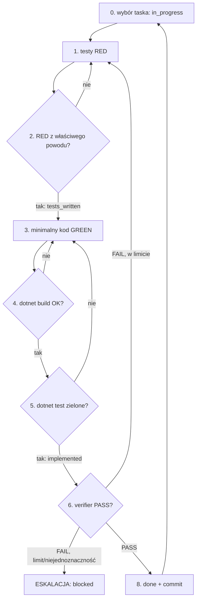

# Task Implementation Loop (maszyna stanów iteracji jednego taska)

Ten skill definiuje **jawną maszynę stanów** realizacji **jednego** taska z `tasks.md`
w cyklu TDD. Orchestrator ładuje go po `backend-impl-conventions` i prowadzi pętlę,
delegując poszczególne kroki do subagentów. Ten skill opisuje *przebieg* — bramki
techniczne definiuje `backend-testing`, reguły dyscypliny `backend-impl-conventions`.

## Zasada: chudy orchestrator (anty-„context rot")

Jakość modelu spada, gdy okno kontekstu się zapełnia. Dlatego **orchestrator jest cienkim
dyspozytorem**, nie wykonawcą:

- **Nie czyta sam `src/`/`tests/`** ani dużych plików — całe ciężkie czytanie i pisanie dzieje
  się w **świeżym kontekście subagenta** (`feature-test-author` / `feature-implementer` /
  `feature-verifier`). Każdy task = świeży kontekst, więc task 50. ma jakość taska 1.
- **Trzyma minimalny stan**: statusy z `tasks.md` + jednolinijkowe streszczenie ostatniego
  werdyktu. Werdykt verifiera redukuje do `PASS|WARN|FAIL` + krótka diagnostyka — **nie**
  wkleja całych logów build/test do swojego kontekstu.
- **Stan żyje na dysku** (`tasks.md` statusy + `docs/features/<slug>/state.md`), więc **świeża
  sesja orchestratora wznawia bez stanu w pamięci** — czyta `tasks.md`, wybiera kolejny
  wykonalny task i kontynuuje. Po każdym zakończonym/zablokowanym tasku zaktualizuj `state.md`
  (jedna sekcja, idempotentnie: faza, taski done/blocked, następna komenda).

## Kroki maszyny stanów

**(0) Wybór taska / fali** — *orchestrator.*
Wybierz następny **wykonalny** task: wszystkie jego **zależności** są w statusie
`done`, a task **nie** jest `blocked` i nie jest już `done`.
Brak takiego taska → koniec przebiegu (patrz „Warunki wyjścia"). Ustaw status `in_progress`.

**Fala równoległa (opcjonalnie, GSD).** Jeśli wśród wykonalnych tasków jest **kilka** oznaczonych
`[P]` o **rozłącznych zbiorach plików** (pole „Obszar kodu / pliki") — możesz potraktować je jako
jedną **falę**: zleć ich kroki RED/GREEN **równolegle**, dispatchując subagentów w jednej turze
(po jednym świeżym kontekście na task). **Warunek bezpieczeństwa**: żadne dwa taski w fali nie
dzielą pliku (inaczej konflikt zapisu) — przy wątpliwości rób je sekwencyjnie. Kroki **(6) weryfikacja,
(8) status i commit pozostają serializowane per task** (single-writer statusów). Brak `[P]`/wątpliwość
= klasyczny tryb sekwencyjny.

**(1) Napisz failujące testy (RED)** — *delegacja do `feature-test-author`.*
Z kryteriów akceptacji taska + powiązanych sekcji `spec.md` (jeśli istnieją — w **ścieżce
szybkiej** `feature-quick` kryteria są **inline** w `tasks.md`, bez `spec.md`) powstają testy;
każde kryterium → co najmniej jeden test (mapowanie wg `backend-testing` §5).

**(2) Uruchom testy — potwierdź RED** — *autor testów / orchestrator.*
`dotnet test` musi pokazać **czerwień z właściwego powodu** (brak implementacji), nie
z przypadkowego błędu kompilacji w niepowiązanym miejscu. Po potwierdzeniu orchestrator
ustawia status `tests_written`.

**(3) Implementuj minimalny kod (GREEN)** — *delegacja do `feature-implementer`.*
Najmniejsza zmiana w `src/` spełniająca testy i kryteria taska, zgodnie z warstwami i
wzorcami repo. Bez wychodzenia poza zakres taska.

**(4) `dotnet build` — musi się kompilować** — *bramka.*
Błąd kompilacji → wróć do (3) z diagnostyką (komunikaty kompilatora).

**(5) `dotnet test` — wszystko zielone** — *bramka.*
Testy taska i cały zestaw na zielono. Fail → diagnozuj: jeśli problem w kodzie → (3);
jeśli test był błędny/niekompletny → (1). Po zielonym orchestrator ustawia status
`implemented`.

**(6) Weryfikacja kryteriów + zgodności ze spec + konstytucji** — *delegacja do `feature-verifier`.*
Verifier uruchamia build/test niezależnie i sprawdza checklistę kryteriów akceptacji,
zgodność ze `spec.md` (kontrakty API, model danych, reguły, bezpieczeństwo) **oraz zgodność z
`docs/constitution.md`** (zasady `P-*`, jeśli istnieje). Jeśli task ma linię `- **Verify**: <komenda>`
— verifier uruchamia ją jako **deterministyczny dowód** ukończenia (obok pełnego `dotnet test`).
**Bramka legalności pakietów (GSD slopcheck)**: jeśli task dodał `PackageReference`, orchestrator
uruchamia `.claude/scripts/check-packages.sh` — `[SLOP]` (pakiet nie istnieje, halucynacja) =
twardy FAIL; `[SUS]` = wymaga jawnego potwierdzenia człowieka (checkpoint). Dla tasków
`Security-critical: yes` (lub gdy task dotyka auth/danych/sekretów) obowiązuje **bramka
bezpieczeństwa** — kontrola **inline** wg `backend-impl-conventions §6` (bez zewnętrznych skilli).
Verifier zwraca werdykt **PASS / WARN / FAIL** + listę niespełnionych pozycji + diagnostykę.
Niczego nie naprawia. *(Ponowne uruchomienie build/test przez verifier — mimo że orchestrator
zrobił to w kroku 5 — jest **celowe**: bramka ma być niezależna od kroku implementacji, nie jest
to duplikat „do zoptymalizowania".)*

**(7) Iteracja przy FAIL / WARN** — *orchestrator.*
**FAIL** dowolnej bramki (RED z błędnego powodu, build, test, kryteria, zgodność ze spec/
konstytucją, bezpieczeństwo, `[SLOP]` pakiet) → **iteruj** z diagnostyką: wróć do (1) gdy
brak/niepoprawny test, do (3) gdy braki kodu. **WARN** (ustalenie nieblokujące) → możesz przejść
do (8), ale **odnotuj** ostrzeżenie (kandydat do przeglądu fazy 6). Obowiązuje **LIMIT iteracji**
= wartość z linii taska `- **Iteration-limit**:` lub **domyślnie 4**. Po przekroczeniu limitu
**lub** przy niejednoznaczności (nie wiadomo, czego oczekuje spec) → **ESKALUJ** (patrz niżej).

**(8) PASS → finalizacja** — *orchestrator.*
Ustaw status taska na `done`. Opcjonalnie utwórz **commit per task**
(kod + testy + zmiana statusu) z jasnym opisem. **Zaktualizuj `state.md`** (postęp + następna
komenda). Wróć do (0) po kolejny task. Gdy wszystkie taski `done` → zasugeruj **fazę 6**
(`feature-reviewer`) jako następny krok.

## Diagram

## Warunki wyjścia (koniec przebiegu)

- Brak kolejnego **wykonalnego** taska (wszystkie `done`, albo pozostałe są
  `blocked`/mają niezrobione zależności) → zakończ i zaraportuj.
- Napotkano blokadę wymagającą decyzji człowieka, której nie da się ominąć innym
  wykonalnym taskiem → zatrzymaj się i eskaluj.

## Warunki eskalacji

Eskaluj (pytanie do człowieka z konkretną luką i opcjami), gdy:

- task wymaga **decyzji projektowej** nieobecnej w `spec.md`/`tasks.md` lub gdy są
  sprzeczne (reguła „nie zgaduj — blokuj");
- przekroczono **limit iteracji** (domyślnie 4) bez przejścia bramek;
- realizacja wymagałaby zmian **poza zakresem** taska (task źle pocięty);
- pojawia się konflikt z istniejącym kodem, którego task nie przewiduje.

Przy eskalacji ustaw status `blocked (reason: <opis>)`, **nie** zostawiaj kodu w stanie
psującym build/testy (cofnij niedokończoną zmianę, jeśli psuje zestaw), zanotuj
diagnostykę i przejdź do innego wykonalnego taska, jeśli istnieje.

## Obsługa taska blocked

- Task `blocked` jest **pomijany** przy wyborze w kroku (0) — orchestrator szuka innego
  wykonalnego taska.
- Zależne od niego taski również pozostają niewykonalne, dopóki blokada trwa.
- Blokada znika dopiero po decyzji człowieka zaktualizowanej w `spec.md`/`tasks.md`
  (faza dokumentacyjna) — wtedy task wraca do `todo`.
