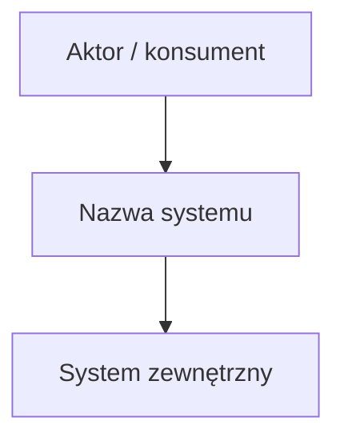
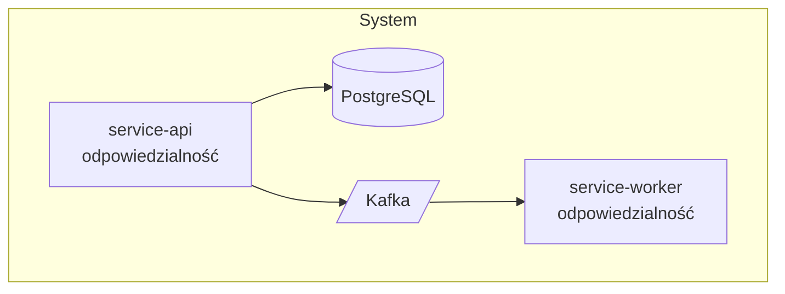
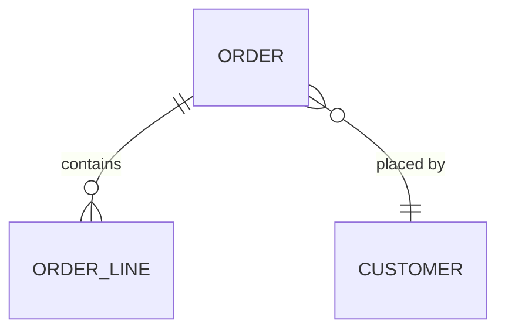

# Doc Templates — project-hld-generator

Gotowe template'y plików generowanych w Fazie 3 i 4. Zasady wspólne:

- Frontmatter i nazwy plików **zawsze po angielsku**; nagłówki sekcji zostają jak w
  template'ach (po angielsku tam, gdzie tak są zapisane); treść pod nagłówkami — w języku
  odpowiedzi dewelopera.
- `[w nawiasach]` — instrukcje do zastąpienia treścią. Sekcje bez danych: zostaw nagłówek
  i wstaw `> TODO: uzupełnić` (lub `> TODO: fill in` po angielsku).
- Założenia przyjęte po odpowiedzi „nie wiem" oznaczaj `> Assumption: ...` i powtórz
  w `## Open Questions`.

## Spis treści

1. [docs/README.md](#docsreadmemd)
2. [docs/architecture/overview.md](#docsarchitectureoverviewmd)
3. [docs/architecture/decisions/README.md](#docsarchitecturedecisionsreadmemd)
4. [Template pojedynczego ADR](#template-pojedynczego-adr)
5. [docs/architecture/data-model.md](#docsarchitecturedata-modelmd)
6. [docs/integrations/external-systems.md](#docsintegrationsexternal-systemsmd)
7. [docs/operations/deployment.md](#docsoperationsdeploymentmd)
8. [docs/operations/runbook.md](#docsoperationsrunbookmd)
9. [docs/development/conventions.md](#docsdevelopmentconventionsmd)
10. [docs/development/testing.md](#docsdevelopmenttestingmd)
11. [docs/development/local-setup.md](#docsdevelopmentlocal-setupmd)
12. [CLAUDE.md (root)](#claudemd-root)

---

## docs/README.md

```markdown
---
last-updated: [YYYY-MM-DD]
owner: [team/person, jeśli znany — inaczej usuń klucz]
status: draft
---

# [Nazwa systemu] — Documentation

[1 akapit: co robi system, dla kogo, na jakim stacku. Bez marketingu.]

[Jeśli istnieje root README.md: "Ogólny opis projektu: patrz [README](../README.md)" —
nie powielaj jego treści.]

## Documentation map

| Dokument | Zawartość |
|----------|-----------|
| [architecture/overview.md](architecture/overview.md) | Komponenty, komunikacja, diagram C4 |
| [architecture/data-model.md](architecture/data-model.md) | Encje, relacje, przepływ danych |
| [architecture/decisions/](architecture/decisions/README.md) | Architecture Decision Records |
| [integrations/external-systems.md](integrations/external-systems.md) | Systemy zewnętrzne, kontrakty, SLA |
| [operations/deployment.md](operations/deployment.md) | Deployment, środowiska, konfiguracja |
| [operations/runbook.md](operations/runbook.md) | Operacje, troubleshooting |
| [development/conventions.md](development/conventions.md) | Konwencje kodu i projektu |
| [development/testing.md](development/testing.md) | Strategia testów |
| [development/local-setup.md](development/local-setup.md) | Uruchomienie lokalne |

## Open Questions

- [niejasności albo "None."]
```

---

## docs/architecture/overview.md

```markdown
---
last-updated: [YYYY-MM-DD]
owner: [jeśli znany]
status: draft
---

# Architecture Overview

## System context (C4 Level 1)

[1–2 zdania: system + aktorzy + systemy zewnętrzne.]



## Containers (C4 Level 2)



[Użyj rzeczywistych nazw projektów/serwisów z repo.]

## Components & responsibilities

| Komponent | Ścieżka w repo | Odpowiedzialność |
|-----------|----------------|------------------|
| [nazwa] | [src/...] | [1 zdanie] |

## Communication

[Sync HTTP/gRPC? Async messaging — jakie topici/kolejki? Shared DB? Konkretne nazwy.]

## Key constraints & decisions

- [np. eventual consistency między X a Y; outbox pattern w Z — link do ADR jeśli jest]

## Open Questions

- [...]
```

---

## docs/architecture/decisions/README.md

```markdown
---
last-updated: [YYYY-MM-DD]
status: draft
---

# Architecture Decision Records

[Jeśli w repo istnieją ADR — zindeksuj je tutaj zamiast tworzyć nowe.]

| ID | Tytuł | Status | Data |
|----|-------|--------|------|
| [ADR-0001](adr-0001-[slug].md) | [tytuł] | [proposed/accepted/superseded] | [data] |

Nowe ADR twórz z template'u poniżej, numeruj sekwencyjnie: `adr-NNNN-krotki-slug.md`.

## Open Questions

- [...]
```

## Template pojedynczego ADR

Proponuj dla kluczowych decyzji wykrytych w Q&A (Faza 5, krok 4). Plik:
`docs/architecture/decisions/adr-NNNN-slug.md`.

```markdown
---
last-updated: [YYYY-MM-DD]
status: draft
---

# ADR-NNNN: [Decyzja w formie zdania, np. "Use Kafka for inter-service messaging"]

- **Status:** [proposed | accepted | superseded by ADR-XXXX]
- **Date:** [YYYY-MM-DD]
- **Deciders:** [jeśli znani]

## Context

[Jaki problem wymusił decyzję. 2–4 zdania.]

## Decision

[Co postanowiono. 1–2 zdania.]

## Consequences

- [pozytywne]
- [negatywne / koszty]

## Alternatives considered

- [alternatywa] — [czemu odrzucona]
```

---

## docs/architecture/data-model.md

```markdown
---
last-updated: [YYYY-MM-DD]
owner: [jeśli znany]
status: draft
---

# Data Model

## Storage

| Storage | Typ | Do czego | Gdzie skonfigurowane |
|---------|-----|----------|----------------------|
| [np. PostgreSQL] | RDBMS | [dane transakcyjne X] | [docker-compose.yml / appsettings] |

## Main entities / aggregates



[Rzeczywiste nazwy encji/tabel/agregatów. Przy DDD — granice agregatów.]

| Encja / agregat | Opis | Kluczowe pola / invarianty |
|-----------------|------|---------------------------|
| [nazwa] | [1 zdanie] | [...] |

## Data flow & consistency

[Skąd dane wchodzą, dokąd wychodzą. Wymagania spójności: transakcje, eventual
consistency, outbox/inbox, idempotencja konsumentów.]

## Open Questions

- [...]
```

---

## docs/integrations/external-systems.md

```markdown
---
last-updated: [YYYY-MM-DD]
owner: [jeśli znany]
status: draft
---

# External Systems & Integrations

| System | Kierunek | Protokół / kontrakt | Auth | SLA / limity | Fallback |
|--------|----------|---------------------|------|--------------|----------|
| [np. payment-provider] | outbound | [REST, OpenAPI w ...] | [API key / OAuth2] | [99.9%, 100 rps] | [retry/circuit breaker?] |

## Contracts

[Gdzie leżą kontrakty: OpenAPI/proto/schematy zdarzeń. Wersjonowanie.]

## Failure modes

[Co się dzieje, gdy integracja pada — degradacja, kolejkowanie, alerty.]

## Open Questions

- [...]
```

---

## docs/operations/deployment.md

```markdown
---
last-updated: [YYYY-MM-DD]
owner: [jeśli znany]
status: draft
---

# Deployment

## Environments

| Środowisko | Gdzie | Jak deployowane | Uwagi |
|------------|-------|------------------|-------|
| [dev/staging/prod] | [k8s cluster / cloud] | [CI pipeline / ręcznie] | [...] |

## Pipeline

[Z `.github/workflows/` lub innego CI — kroki: build → test → publish → deploy.
Mermaid `flowchart LR` jeśli pipeline ma rozgałęzienia.]

## Configuration & secrets

| Zmienna | Do czego | Skąd |
|---------|----------|------|
| [CONNECTION_STRING] | [...] | [env / vault / k8s secret] |

## HA / DR

[Repliki, multi-region, RTO/RPO — albo TODO.]

## Open Questions

- [...]
```

---

## docs/operations/runbook.md

```markdown
---
last-updated: [YYYY-MM-DD]
owner: [jeśli znany]
status: draft
---

# Runbook

## Health & observability

[Endpointy health, dashboardy, logi, metryki — gdzie patrzeć najpierw.]

## Common operations

### [Operacja, np. restart workera]

1. [krok — konkretna komenda]

## Troubleshooting

| Symptom | Prawdopodobna przyczyna | Co zrobić |
|---------|--------------------------|-----------|
| [np. lag na topicu X rośnie] | [...] | [...] |

## Do not touch without consultation

[Miejsca wskazane w Q&A (Tura 6) — z uzasadnieniem.]

## Open Questions

- [...]
```

---

## docs/development/conventions.md

```markdown
---
last-updated: [YYYY-MM-DD]
owner: [jeśli znany]
status: draft
---

# Project Conventions

## Code conventions

- [konkretne, weryfikowalne reguły: wzorce obowiązkowe, nazewnictwo, struktura warstw]

## Git workflow

- Branch naming: [np. feature/JIRA-123-slug]
- Commit messages: [np. Conventional Commits]
- [PR/review flow]

## Code review rules

- [wymagany coverage, liczba approvali, zakazy]

## AI-assisted development

[Reguły dla Claude/AI z Tury 5 — co wolno, czego nie. Spójne z CLAUDE.md w root,
ale tu może być pełniejsze uzasadnienie.]

## Open Questions

- [...]
```

---

## docs/development/testing.md

```markdown
---
last-updated: [YYYY-MM-DD]
owner: [jeśli znany]
status: draft
---

# Testing

## Strategy

| Poziom | Framework | Gdzie | Zakres |
|--------|-----------|-------|--------|
| Unit | [np. xUnit + FluentAssertions] | [tests/...] | [...] |
| Integration | [...] | [...] | [...] |

## How to run

```bash
[zweryfikowane komendy z repo — dotnet test / npm test / make test]
```

## Coverage

[Target z Q&A albo TODO. Jak mierzony.]

## Open Questions

- [...]
```

---

## docs/development/local-setup.md

```markdown
---
last-updated: [YYYY-MM-DD]
owner: [jeśli znany]
status: draft
---

# Local Setup

## Prerequisites

- [SDK/runtime z wersją — z konfigów, np. .NET 8, Node 20]
- [Docker, jeśli compose używany]

## Steps

```bash
[zweryfikowana sekwencja: clone → restore/install → infra (docker compose up) → run]
```

## Verify it works

[Jak sprawdzić, że działa: URL, health endpoint, przykładowy request.]

## Common issues

- [problem → rozwiązanie, jeśli znane]

## Open Questions

- [...]
```

---

## CLAUDE.md (root)

Pełne zasady i anty-wzorce: `references/claude-md-patterns.md`. Szkielet:

```markdown
# CLAUDE.md

## Project Overview
[2–3 zdania: co robi system, główny stack, skala.]

## Architecture
[komponent → ścieżka, po jednej linii. Szczegóły: docs/architecture/overview.md]

## Build & Run
[dokładne, zweryfikowane komendy w bloku bash: build / test / lint / run]

## Key Conventions
- [tylko reguły falsifiable, np. "Nowe endpointy ZAWSZE przez MediatR handler, nie w kontrolerze"]
- [np. "Testy w xUnit + FluentAssertions, bez MSTest"]
- [np. "Nie modyfikuj plików w /generated/ — auto-generowane"]

## What NOT To Do
- [explicit zakazy, np. "Nie dodawaj NuGet packages bez konsultacji"]
- [np. "Nie zmieniaj schematu DB bez migracji EF Core"]

## Navigation Hints
- [zadanie → ścieżka, np. "Nowy endpoint API → src/Api/Controllers/ + src/Application/Commands/"]

## Testing
[1–3 linie: komenda, lokalizacja testów, target coverage]

## Docs
[1–2 linie: docs/ — co gdzie, link do docs/README.md]
```
